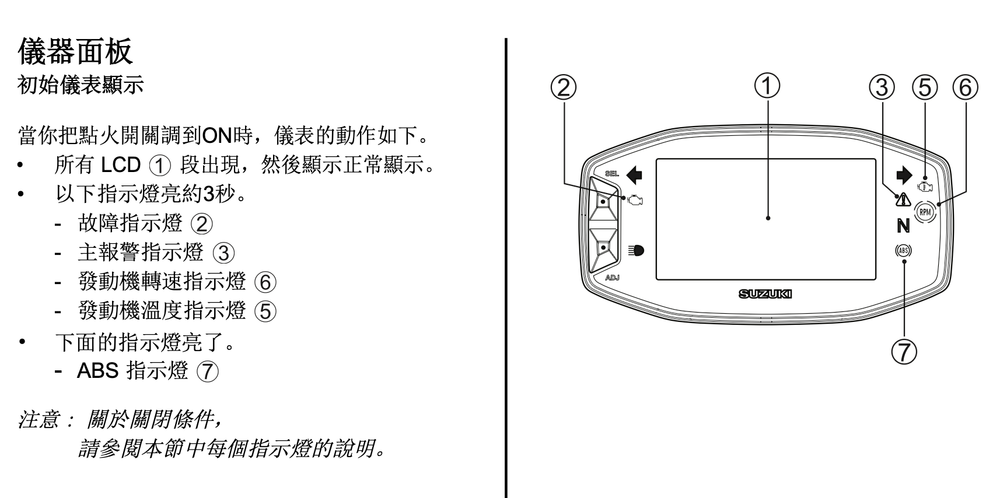
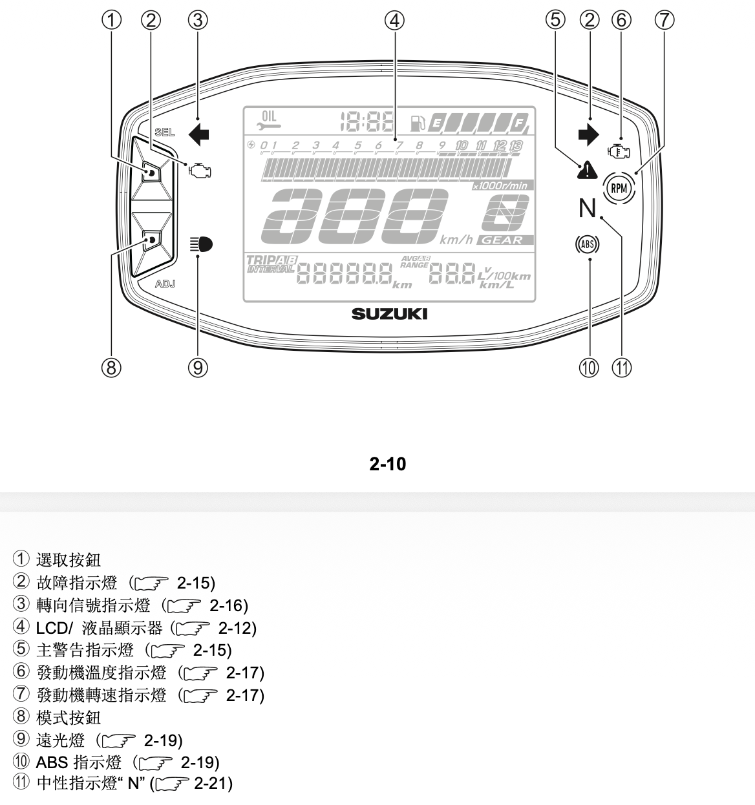
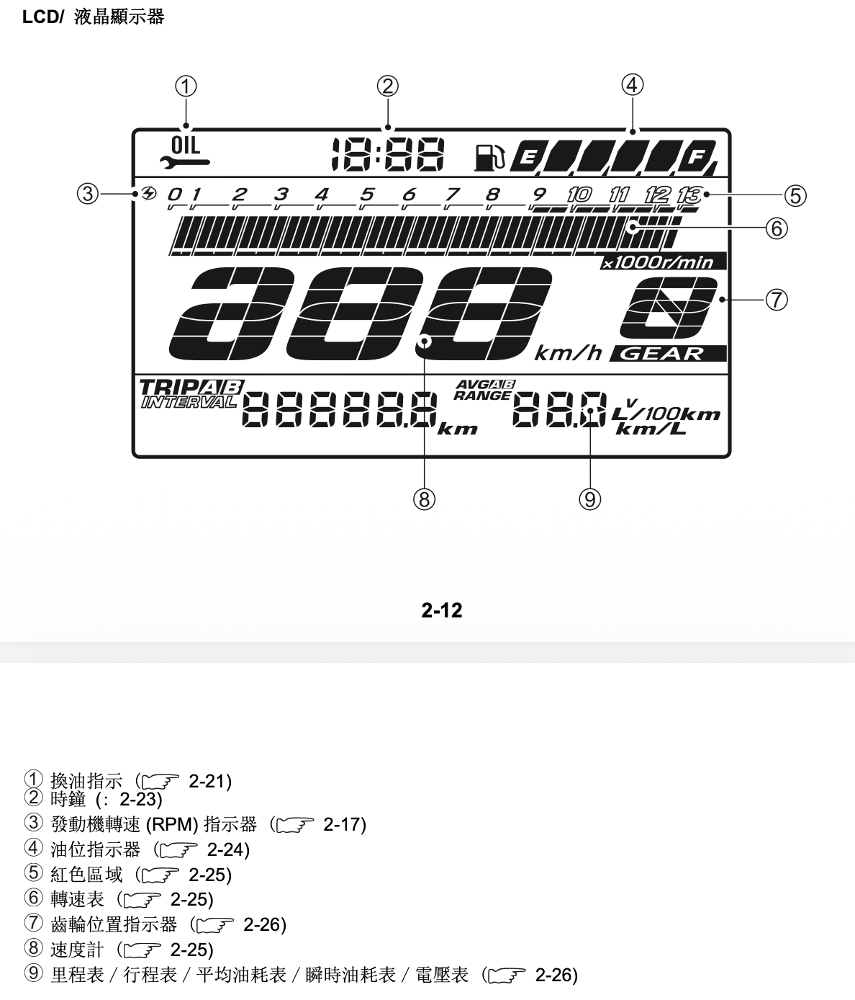
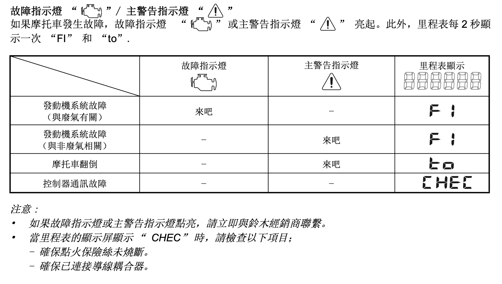

# SUZUKI V-Strom 250SX 交車點交檢查清單

> 作者：Alexander Lin｜授權：[CC BY 4.0](https://creativecommons.org/licenses/by/4.0/deed.zh-hant)｜轉載/引用請標註作者與來源：<https://github.com/sspig0127/suzuki-vstrom250sx-tw>

---

## 一、交車現場檢查(領牌/交車當下,業務在旁時就要看)

- [ ] 引擎序號、車身號碼與行照/合格證相符
- [ ] 拍照：里程數是否合理(新車應接近 0~試乘公里數) 
- [ ] 拍照：車身外觀:烤漆、鈑件、風鏡有無刮傷、裂痕、色差
- [ ] 拍照：排氣管外觀:是否有磕碰、明顯鏽斑或塗裝脫落
- [ ] 前後輪胎:出廠日期(胎壁四位數字)、胎壓、有無異物
- [ ] 燈系實際點亮測試:頭燈(遠近光)、方向燈、煞車燈、喇叭(開關操作細節與儀表警示燈逐一確認,見下方「業務操作講解」段落)
- [ ] 煞車拉桿/踏板、離合器拉桿的行程手感是否正常(段位調整功能是否具備,見下方「煞車/離合器拉桿是否有段位調整功能」項目)
- [ ] 兩側後照鏡角度、把手操作順暢度
- [ ] 側/中柱彈簧回位是否正常
- [ ] 保養手冊、保固卡是否齊全(隨車工具、備用鑰匙細節見下方「坐墊」「鑰匙」對應項目)
- [ ] 機油、冷卻液液面是否在正常範圍
- [ ] 電瓶電壓(可請店家用電表現場量,約 12.5V 以上為正常)

### 業務操作講解時應請對方示範/確認項目

> 參考 SUZUKI ZONE(スズキゾーン)原廠日本經銷商[「納車說明」影片](https://youtu.be/Wcv19vGNH6g)整理,前者為 **V-Strom 250SX 專用版**(與本車款相符), 以現場實車與台灣版車主手冊為準。

- [ ] **鑰匙(2支)用途確認**:主開關(イグニッション)、油箱蓋、坐墊(タンデムシート)開啟共用同一把鑰匙,3個位置都要試插一次

- [ ] **龍頭鎖(ハンドルロック)上鎖/解鎖操作**:把手打左滿舵→鑰匙插入往內壓同時逆時針轉→拔出即上鎖;解鎖則鑰匙插入壓著轉回 OFF 位置。請業務當場示範一次,自己也操作一次確認手感

- [ ] **發動程序**:確認為「必須握住離合器拉桿 + 排入空檔(儀表 N 燈亮)+ 按一下(非長按)啟動鈕」即可(配備 Suzuki Easy Start System);現場實際發動一次確認

- [ ] **油箱蓋開闔方式**:用鑰匙操作(影片描述為鑰匙插入後, 順時針將橫向鑰匙孔轉為直立方向,解鎖開啟,鎖上則是蓋體壓下轉動至聽到「喀」聲後確認蓋體壓平, 再拔鑰匙) 建議現場實際操作確認,參考時間軸:[01:50](https://youtu.be/Wcv19vGNH6g?t=110)~[02:16](https://youtu.be/Wcv19vGNH6g?t=136)

- [ ] **油箱容量與油品**:確認為無鉛/普通汽油(レギュラー),SX 版容量約 12L（92 或 95 無鉛汽油）

- [ ] **坐墊(坐墊開啟後置物空間)**:確認坐墊下方置物空間可放置行照/證件等小物,且標配隨車工具組是否確實裝在坐墊下方

- [ ] **坐墊裝回鎖上方式**:對準車架卡榫後往下壓緊確認扣合到位(鬆動的坐墊行駛中會異音或移位)

- [ ] **安全帽扣鎖(ヘルメットホルダー)**:確認原廠標配是否含安全帽扣鎖(影片說明 250SX 原廠**未**標配,需另加購選配)——若無,可列入之後選配清單

- [ ] **煞車/離合器拉桿是否有段位調整功能**:請業務明確說明「250SX 版本」的拉桿(煞車、離合器)**是否具備段位調整**(依影片內容,250SX 兩支拉桿皆無調整段位功能,但非SX的大陸製水冷車 250有;此為兩車型差異)

- [ ] **把手開關功能逐一按過一次**:右側 Kill Switch(熄火開關)ON/OFF、右側啟動鈕;左側遠近燈切換、超車燈(黃色按鈕/パッシング)、方向燈左右+按壓取消、喇叭

- [ ] **儀表板功能逐一操作**:
  - [ ] 確認時速、轉速、油量表、電壓顯示位置
  - [ ] 確認排檔位置指示(N燈只在空檔時亮)
  - [ ] 確認 Trip A / Trip B / 總里程切換方式(SELECT鍵切換畫面、ADJUST鍵切換平均油耗/瞬間油耗/電壓顯示)
  - [ ] 確認 Trip B 歸零方式(長按 SELECT 鍵)
  - [ ] 確認時鐘校時方式(SELECT + ADJUST 同時長按進入設定, 數為時鐘文字會閃爍, 按上方 SEL 來切換設定的碼位, 按下 ADJ 來調整數字, 設定好時間後, SELECT + ADJUST 同時長按來將設定存檔, 參考時間軸:[06:11](https://youtu.be/Wcv19vGNH6g?t=371)~[06:47](https://youtu.be/Wcv19vGNH6g?t=407))
  - [ ] 確認轉速升檔提示燈(シフトアップインジケーター)的設定/開關方式是否可自訂(影片提到可設定觸發轉速、可切換閃爍/恆亮/關閉,建議現場示範一次,參考時間軸:[08:45](https://youtu.be/Wcv19vGNH6g?t=525)~[10:44](https://youtu.be/Wcv19vGNH6g?t=644))
  
- [ ] **儀表警示燈逐一指認意義**(現場請業務對照儀表實際亮燈位置說明,音檔文字描述的左右配置建議現場再次確認,參考時間軸 [06:47](https://youtu.be/Wcv19vGNH6g?t=407)~[11:25](https://youtu.be/Wcv19vGNH6g?t=685)):
  
  
  
  
  
  
  
  
  
  
  
  
  
  
  - [ ] 方向燈指示燈(左右各一)
  
  - [ ] 引擎故障警示燈(エンジンチェックランプ)
  
  - [ ] 遠光燈指示燈
  
  - [ ] 綜合警示燈(マスターウォーニングインジケーターライト,異常/感應器故障/主開關故障時亮起)
  
  - [ ] 檔位顯示(僅空檔時顯示 N)
  
  - [ ] ABS 警示燈(非行駛中, 開電門, 燈號會亮起，發動後騎乘，警示燈應該會暗掉，如果是行駛中恆亮或閃爍代表 ABS 異常、未介入作動,需特別留意這顆燈熄滅的時機)
  
  - [ ] 儀表最右側上方：引擎溫度警示燈(超過設定水溫時亮起)
  
  - [ ] **多功能顯示區切換方式**：儀表下方的多功能顯示區可切換多種資訊，分成兩組各自獨立循環——短按 **SEL** 鍵依序切換「里程表 → 行程表 A → 行程表 B」；短按 **ADJ** 鍵依序切換「平均油耗表 A → 平均油耗表 B → 瞬時油耗表 → 電壓表」。先熟悉這兩顆鍵的邏輯，下方幾項指示燈設定都會用到（中/英文版 P.2-25~2-26、日文版 P.55）。

  - [ ] **機油更換指示燈（オイルチェンジインジケータ／Oil Change Indicator）**：提醒該換機油了，初次於 1,000 km 亮起，之後依預設間隔重複提醒；**換完機油後務必手動重置**，否則會持續提醒（中文版 P.2-20~2-21、英文版 P.2-21~2-22、日文版 P.57~59）：

    - **重置方式**：先關閉點火開關 → 按住 SEL 鍵不放，同時將點火開關轉 ON，繼續按住 SEL 鍵 4 秒 → 換油指示燈閃爍 3 次後熄滅，代表重置完成（即使指示燈當下沒亮、或里程數還沒到，也建議每次換完機油都重置一次）。
    - **調整預設換油間隔**：儀表切到「里程表」畫面 → 長按 SEL 鍵 2 秒，直到 INTERVAL 與 OIL CHANGE 字樣閃爍 → 按 SEL 鍵以 500 km 為單位縮短間隔、按 ADJ 鍵以 500 km 為單位延長間隔 → 長按 SEL + ADJ 鍵 2 秒退出。
    - **⚠️ 規格差異**：中/英文外銷版預設間隔為 **5,000 km**（可調範圍 500～5,000 km）；日規版預設為 **6,000 km**（可調範圍 500～6,000 km）。若不確定自己車輛的實際規格，建議直接以儀表目前顯示的 INTERVAL 數值為準，不要照搬手冊語言版本的預設值。

  - [ ] **燃油油位指示器（フューエルメータ／Fuel Level Indicator）**：確認油量圖示與分段顯示邏輯，滿油時 6 格全亮；低於 2.8 L 時油箱圖示開始閃爍；低於 1.2 L 時圖示與最後一格分段一起閃爍，代表接近見底（三語手冊頁碼一致：中/英文版 P.2-23~2-24、日文版 P.67）：

    - **注意**：側柱撐車（車身傾斜）時油位顯示可能不準，須車身直立、點火開關 ON 時讀取才準確；閃爍時應盡快加油，避免用盡油箱汽油（原廠手冊註明可能損傷觸媒轉換器）。

  - [ ] **切換儀表到「電壓表」畫面**（設定下一項發動機轉速指示燈的前置動作）：依上方切換邏輯，持續短按 **ADJ** 鍵，直到畫面出現電壓表（顯示電池電壓，正常範圍 10.0～16.0V）為止。

  - [ ] **儀表最右側下方：發動機轉速指示燈（エンジン回転インジケータライト／Engine RPM Indicator Light）**：當轉速到達自訂的 rpm 門檻值時，此燈會「恆亮」或「閃爍」提示升檔，點燈方式與門檻轉速皆可自訂（原廠三語手冊步驟一致：中/英文版 P.2-17~2-18、日文版 P.61-62）：

    - **① 進入設定模式**：熄火駐車、點火開關轉 ON，先將儀表切換到顯示「電壓表」畫面，接著長按 ADJ 鍵 2 秒以上，才會進入指示燈設定模式（進入後電壓表畫面會消失）。
    - **② 選擇點燈方式**：短按 ADJ 鍵切換，循環為「恆亮 LIGHT → 閃爍 BLINK → 不啟用 NO LIGHT → 恆亮…」；選定後按 SEL 鍵確認。若選「不啟用」，設定到此結束；若選「恆亮」或「閃爍」，會自動接續下一步的門檻轉速設定。
    - **③ 設定門檻轉速**：按 ADJ 鍵以 500 rpm 為單位調整（範圍 4,000～10,000 rpm），數值會顯示在儀表轉速條上；調到想要的門檻後按 SEL 鍵儲存，即完成設定並回到正常顯示畫面。
    - **注意**：設定過程中若車速超過 10 km/h 或將點火開關轉 OFF，設定會直接取消、不會儲存，請務必在熄火/怠速原地時操作完成。此燈是「升檔提醒」，不是轉速紅線警示（紅線區原廠手冊未列明確數字，見下方訓車說明）。

  - [ ] 動力數據
  	
  	- **最大扭力**：22.2 Nm（約 2.26 kg-m）/ 7,300 rpm  假設 7300 － 2000 =5,300  大約是扭力峰值，所以平順省油的換檔大約落在扭力峰值 5300 左右換檔是省油，在 5300 ～ 7300 之間換檔是車速較快。平常騎乘可接受的最低轉速為 5300 - 3000= 2300 rpm 最低可接受的巡航轉速。
  	- **最大馬力**：26.5 PS / 9,000–9,300 rpm
  	
  	
  	
  	
  
- [ ] **USB 供電孔**:確認儀表左側面板掀開後內有標配 USB 供電孔,現場測試手機是否能充電

	- [ ] **輪胎胎壓標示核對**:確認車輛左側搖臂(スイングアーム)上是否有胎壓標示貼紙,並與音檔提到的參考值(
		單人:前輪1.75kPa (1.75 kgf/c㎡ ; 25 Bar)、後輪2.0kPa (2.00 kgf/c㎡ ; 29 Bar) ;
		雙載:前輪1.75kPa (1.75 kgf/c㎡ ; 25 Bar)、後輪2.25kPa (2.25 kgf/c㎡ ; 33 Bar, 實際上可能會更高),
		務必以車身貼紙與台灣版車主手冊實際數字為準

---

## 參考來源

- [SUZUKI ZONE 原廠納車說明:V-Strom 250SX 各種開關/鑰匙/儀表操作說明](https://youtu.be/Wcv19vGNH6g)(日文,12:24)
- [SUZUKI ZONE 原廠納車說明:V-Strom 250 各種開關/鑰匙/儀表操作說明](https://youtu.be/UIGCjLDNz_8)(日文,6:36,非SX版本僅供對照)

